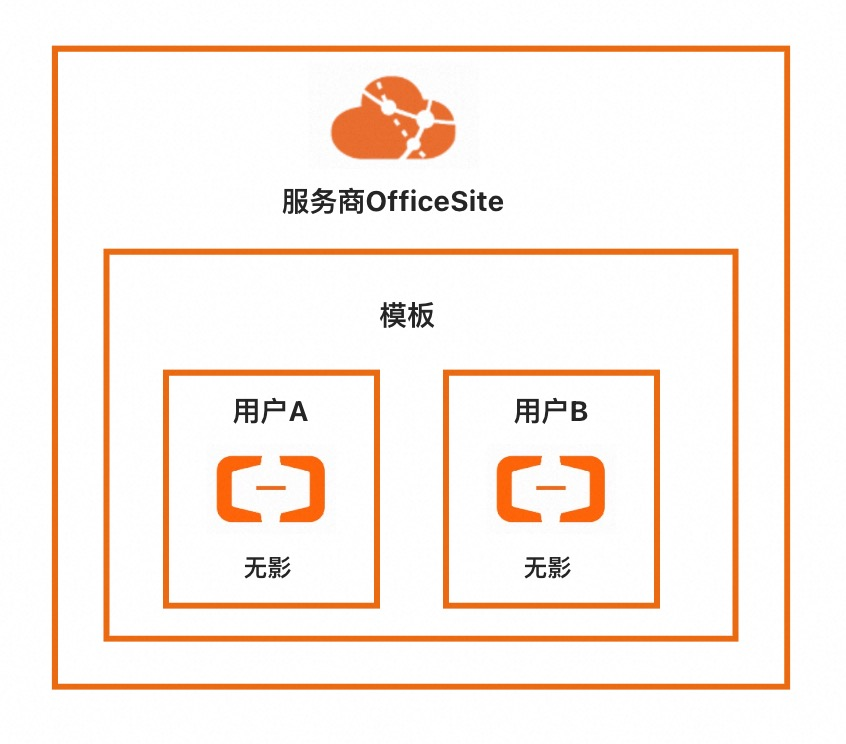
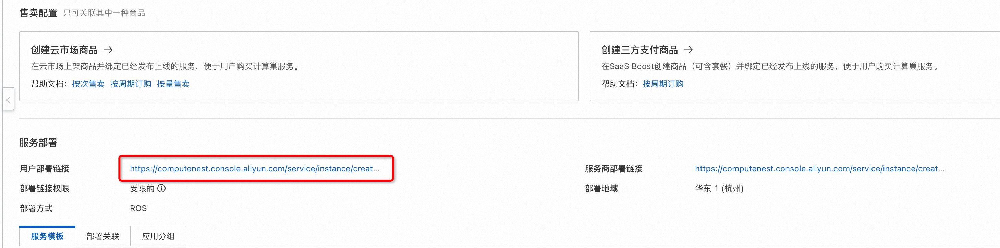
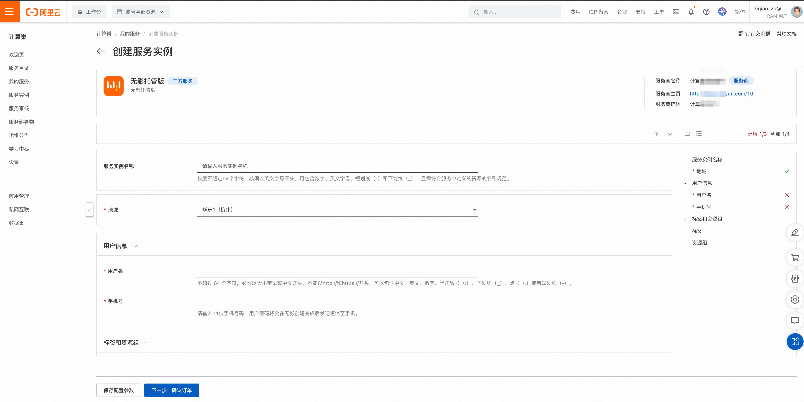
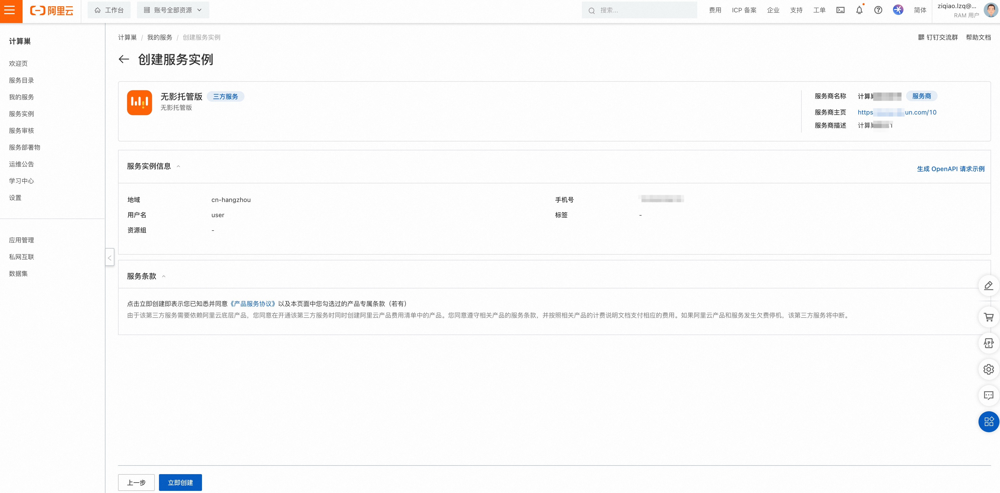
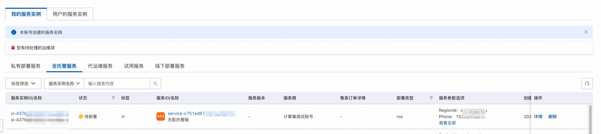
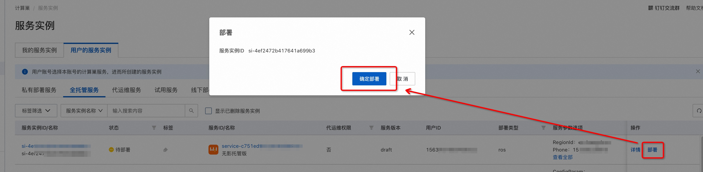
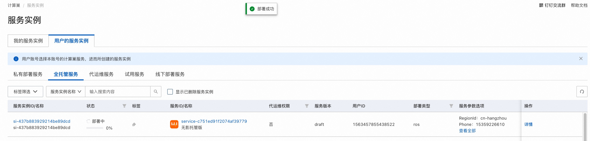
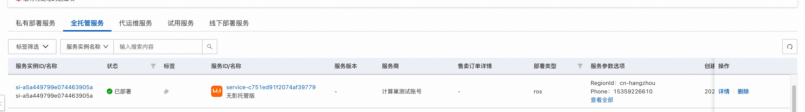
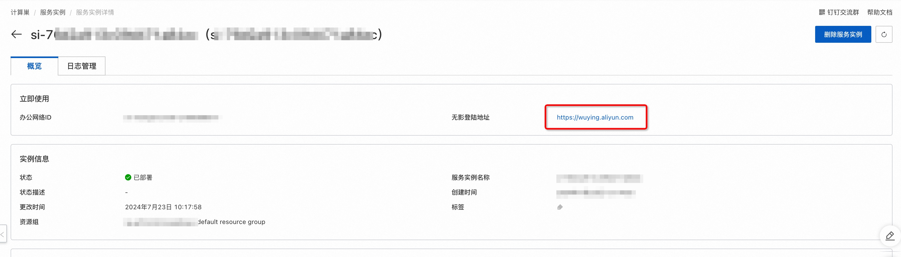

# 服务模板说明文档

## 服务说明

本文介绍快速构建无影托管版单租户计算巢服务，关于计算巢托管版可以参考[帮助文档](https://help.aliyun.com/zh/compute-nest/create-a-fully-managed-service?spm=a2c4g.11174283.0.i5)，

本示例对应的Git仓库地址：[wuying-managed-demo](https://github.com/aliyun-computenest/wuying-managed-demo)。

本示例会自动的构建计算巢服务， 创建过程大约持续3分钟，当服务变成待提交后构建成功。

## 部署架构

本服务仅部署一台无影云桌面，具体架构如下。

## 服务构建计费说明

测试本服务构建无需任何费用，创建服务实例涉及的费用参考服务实例计费说明。

## RAM账号所需权限

本服务需要对无影云桌面资源进行访问和创建操作，若您使用RAM用户创建服务实例，需要在创建服务实例前，对使用的RAM用户的账号添加相应资源的权限。添加RAM权限的详细操作，请参见[为RAM用户授权](https://help.aliyun.com/document_detail/121945.html)
。所需权限如下表所示。

| 权限策略名称                              | 备注                          |
|-------------------------------------|-----------------------------|
| AliyunECDFullAccess                | 管理无影云电脑和无影云应用的权限            |
| AliyunROSFullAccess                 | 管理资源编排服务（ROS）的权限            |
| AliyunComputeNestUserFullAccess     | 管理计算巢服务（ComputeNest）的用户侧权限  |
| AliyunComputeNestSupplierFullAccess | 管理计算巢服务（ComputeNest）的服务商侧权限 |

## 服务实例计费说明

测试本服务在计算巢上的费用主要涉及：

- 无影云桌面费用

计费方式包括：

- 按量付费（小时）

## 部署流程

### 部署参数说明

| 参数组    | 参数项            | 示例          | 说明                                                                 |
|--------|----------------|-------------|--------------------------------------------------------------------|
| 服务实例名称 |                | test        | 实例的名称                                                              |
| 资源组和地域 | 资源组            | 默认资源组       | 创建的服务实例位于的资源组。                                                     |
| 资源组和地域 | 地域             | 华东1（杭州）     | 选中服务实例的地域，建议就近选中，以获取更好的网络延时。                                       |
| 用户信息   | 用户名            | user        |  不超过 64 个字符，必须以大小字母或中文开头，不能以http://和https://开头，可以包含中文、英文、数字、半角冒号（:）、下划线（_）、点号（.）或者短划线（-）。|
| 用户信息   | 手机号          | 153******** | 请输入11位手机号码，用户密码将会在无影创建完成后发送短信至手机。       |                                 |

### 部署步骤
说明：本服务需要用户输入用户名与手机号。若用户名与手机号不存在，将创建无影用户；否则将引用已有用户信息。

0. 进入服务，单击部署链接。
   
1. 进入服务实例部署界面，根据界面提示，填写参数完成部署。
   
2. 参数填写完成后可以看到对应参数，确认参数后点击**立即创建**，进入部署阶段。
   
3. 用户侧可以看到服务实例处于待部署状态。
   
4. 服务商可以点击部署，开始进入部署阶段。
   
   
5. 等待部署完成后就可以开始使用服务，进入服务实例，点击**无影登陆地址**。
   
   
   
   输入办公网络ID，进入账号密码输入页，账号密码会通过短信发送到创建服务实例时输入的手机号中。输入密码后，即可进入云桌面。
   
   

## 服务详细说明

文件说明：

| 文件路径                      | 说明                                                                                                                   |
|---------------------------|----------------------------------------------------------------------------------------------------------------------|
| config.yaml               | 构建服务的配置文件，服务构建过程中会使用计算巢命令行工具[computenest-cli](https://pypi.org/project/computenest-cli/)，computenest-cli会基于该配置文件构建服务。 |
| parameters.yaml           | 本服务为托管版单租，使用该文件渲染服务商需要配置的云桌面参数，包括办公网络ID、模板ID、策略ID。                                                                   |
| icons/service_logo.png    | 构建服务默认的图标。                                                                                                           |
| templates/parameters.yaml | 本服务为托管版单租服务，所以只需要用户填写一部分参数，通过该文件指定用户所填参数。                                                                            |
| templates/template.yaml   | ROS模板文件，ROS模板引擎根据该模板能够自动创建出所有的资源。                                                                                    |